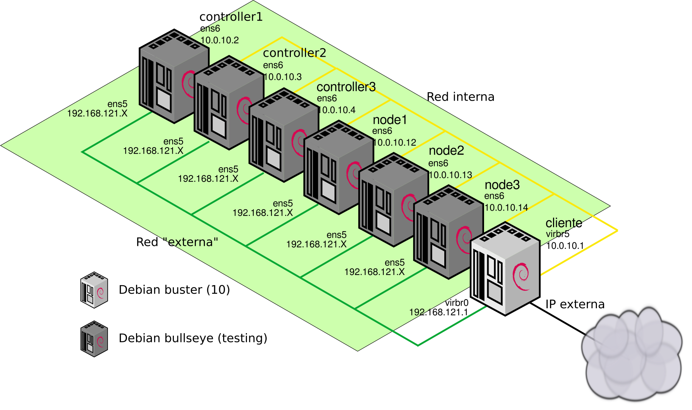

# k8s_debian_vagrant

Adaptación de
[Kubernetes The Hard Way](https://github.com/kelseyhightower/kubernetes-the-hard-way)
utilizando un despliegue con vagrant sobre KVM/libvirt con imágenes de
Debian Bullseye (testing) en lugar de un despliegue con
infraestructura de nube pública con gcloud. Esto permite realizar el
despliegue en una instancia de cualquier nube pública o privada o una
máquina virtual o física en cualquier ubicación.

El despliegue que se realiza es muy similar al original, pero en este
caso se utilizan los paquetes binarios que proporciona el proyecto
debian para la mayoría de los componentes, en algunos casos estos
paquetes incluyen parte del trabajo posterior de configuración
(algunas unidades de systemd o ficheros de configuración), aunque en
otros de estos paquetes están en una fase inicial de desarrollo y
carecen de algunos elementos habituales de configuración. En
particular, utilizamos paquetes binarios para etcd, kubernetes-master,
kubernetes-node, kubernetes-client, containerd y runc.

Al igual que el despliegue original, el propósito de instalar
kubernetes paso a paso es principalmente comprender los elementos que
lo componen y la forma de configurarlos, por lo que el clúster que
terminamos configurando dista bastante de uno listo para utilizar en
producción.

## Requisitos

Una máquina con 16GiB de RAM con capacidad para ejecutar KVM (si es
una máquina virtual tiene que estar adecuadamente configurada la
virtualización anidada).

## Características

* etcd 3.2.26
* runc 1.0.0
* containerd 1.4.1
* cni 0.8.6
* kubernetes 1.18.6
* coredns 1.7.0

## Parámetros del despliegue:

* IP Flotante: IP pública o privada que corresponda
* Red "externa": 192.168.121.0/24
* Red interna: 10.0.10.0/24
  * controller1: 10.0.10.2
  * controller2: 10.0.10.3
  * controller3: 10.0.10.4
  * node1: 10.0.10.12
  * node2: 10.0.10.13
  * node3: 10.0.10.14
* Service-cluster-ip-range: 10.32.0.0/24
* cluster-cidr: 10.200.0.0/16
* pod-cidr: 10.200.X.0/24

## Esquema de red

## Índice

* [Configuración del escenario](01-escenario.md)
* [CA y certificados](02-CA.md)
* [Claves de cifrado](03-claves-cifrado.md)
* [Configuración de etcd](04-etcd.md)
* [Ficheros de configuración de kubernetes](05-ficheros-configuracion-k8s.md)
* [Configuración de los controladores](06-kubernetes-controllers.md)
* [Configuración de los nodos](07-kubernetes-nodes.md)
* [kubeconfig para admin](08-configuracion-kubectl.md)
* [Definición de rutas estáticas](09-rutas-estaticas.md)
* [Configuración del coreDNS](10-coredns.md)
